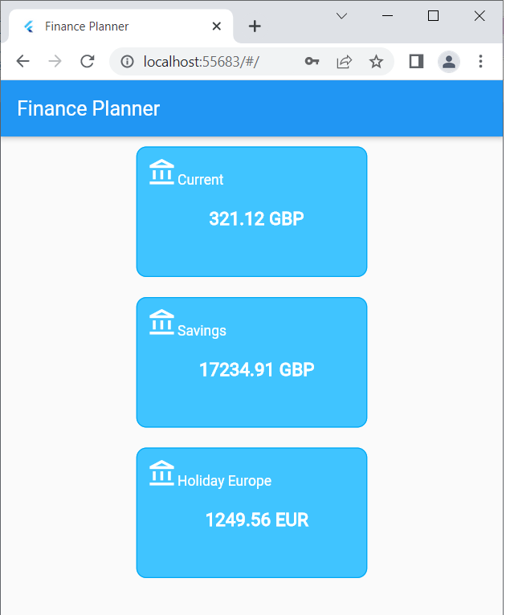

# Client Application

POC Flutter Application consuming the Finanance Planner API.

It provides a login screen:

This will invoke the Tokens api and store locally the obtained JWT token and the user ID needed for following API calls.

It then provides an overview of all the user Bank Accounts:

which are obtained from the Accounts api.

