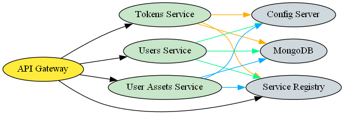
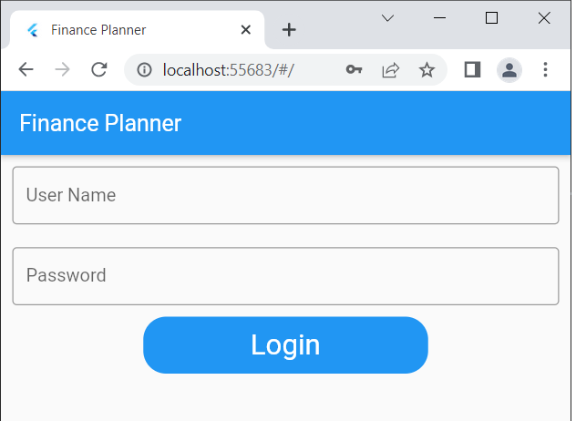
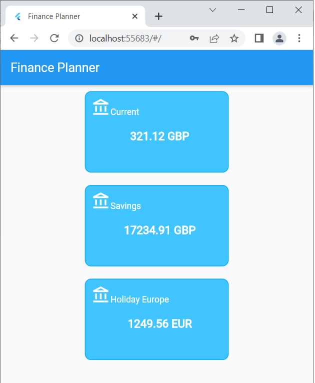

POC application to explore Spring Boot and Kotlin. The application implements authentication (outside the Spring Boot Authentication framework) and a simple CRUD HTTP API to manage user and user assets.

It's structured as a set of microservices and demonstrates a discovery service, API gateway, lightweight messaging between services (Rabbit MQ) and database persistance.

As a spin-off of the main theme, I added a Flutter application to consume the API, see [below](#frontend).

# Backend

The backend is built as a set of microservices in Spring Boot/Kotlin, with a MongoDB instance for persistence and a
RabbitMQ server for inter-service communication. The services are organized as depicted below:



## Ancillary Services

These are the fundamental services providing the infrastructure for the actual client facing service.

### Config Server

The Config Server ([src/backend/config-server](./src/backend/config-server)) provides centralized configuration for
all services. This is
based [Spring Cloud Config](https://docs.spring.io/spring-cloud-config/docs/current/reference/html/). The configuration
is backed by a local git repo, which allows also to keep track of changes. Examples of expected config files entries,
(sanitized of sensitive data), are provided
in [./src/backend/config-server/expected-config](./src/backend/config-server/expected-config). The Config Server is also
registered with the Service Registry, so it can be discovered automatically and doesn't need to be hardwired in each
service.

### Service Registry

The Service Registry ([src/backend/service-registry](./src/backend/service-registry)) provides the ability to services
to be discovered by others. It's an
out-of-the-box [Netflix Eureka Server](https://spring.io/projects/spring-cloud-netflix).

### Api Gateway

The Api Gateway ([src/backend/api-gateway](./src/backend/api-gateway)) is the only public facing edge node and is
responsible to route the traffic to the specific microservices, it can also provide rate limiting for API calls.
It's a very thin service that relies on the `service-registry` to locate the other public APIs endpoints and setup
routing. This, in turn, allows the traffic to the single services instances to be load-balanced. It's an out-of-the-box,
vanilla [Spring Cloud Gateway](https://spring.io/projects/spring-cloud-gateway) with the routes set to be resolved by
the Service Registry.

## Public API services

## Tokens Service

The Tokens Service ([src/backend/services/tokens](./src/backend/services/tokens)) is responsible to provide
[JWT tokens](https://jwt.io/introduction) to authenticate the users in exchange for suitable user credentials (email +
password) over a public HTTP API. It also exposes an internal service endpoint by means of a RabbitMQ
queue ([Spring AMQP](https://spring.io/projects/spring-amqp)) which allows other services to validate the token they
receive from client requests. This encapsulates fully all tokens related logic in the service and allows, if needed, to
change the underlying token technology without impacting the other services. User credentials are stored in a dedicated
MongoDB table, user password is salted and hashed and are received also by means of an internal service endpoint running
on a RabbitMQ queue (in this case triggered by the user creation operation in the Users Service).

## Users Service

The Users Service ([src/backend/services/users](./src/backend/services/users)) is responsible to provide an API to
create and update users and user data. This is a public facing API exposed by the Api Gateway. The only fully open
endpoint is the user creation endpoint, out of necessity. Public deployment of the service will require at least rate
limiting on the endpoint (e.g. based on IP address), but also an email verification mechanism and a TTL on the
unconfirmed accounts. The service is based
on [Spring Web MVC](https://docs.spring.io/spring-framework/docs/current/reference/html/web.html#spring-web) which
provides the scaffolding for the API service. In particular `@RestController` and filters. A custom filter is hooked
in the request chain (see `AuthenticationFilter`) which is responsible to resolve the `Authorization` header and
validate the token against the Tokens Service internal token validation service (Rabbit MQ queue), this provides custom
authentication for all routes and methods (except for the user creation, see above). Users are stored in a separate 
MongoDB table than the one used for Users Credentials by the Tokens Service to avoid coupling.

## User Assets

The Users Assets Service ([src/backend/services/users](./src/backend/services/user-assets)) is responsible to provide an
API to create and manage user assets (e.g. Bank Accounts). Othen than for the resources exposed it's identical in 
architecture to the Users Service.

## Public API

Create a user.
```
curl --request POST 'http://127.0.0.1:8090/api/users' \
--header 'Content-Type: application/json' \
--data-raw '{
    "name": "nicolaA8",
    "email": "nicolaA8@example.com",
    "password": "test"
}'

201 CREATED
{
    "id": "63ac3329c399db522a13d52a",
    "name": "nicolaA8",
    "email": "nicolaA8@example.com"
}
```

Get a token for the user:
```
curl --request POST 'http://127.0.0.1:8090/api/tokens' \
--header 'Content-Type: application/json' \
--data-raw '{
    "email": "nicolaA8@example.com",
    "password": "test"
}'

200 OK
{
    "token": "[token]",
    "ttl": 86400,
    "user_id": "63ac3329c399db522a13d52a"
}
```

Get the user.
```
curl --request GET 'http://127.0.0.1:8090/api/users/63ac3329c399db522a13d52a' \
--header 'Authorization: Bearer [token]'

200 OK
{
    "id": "63ac3329c399db522a13d52a",
    "name": "nicolaA8",
    "email": "nicolaA8@example.com"
}
```

Update user password.
````
curl --request PATCH 'http://127.0.0.1:8090/api/users/63ac3329c399db522a13d52a' \
--header 'Authorization: Bearer [token]' \
--header 'Content-Type: application/json' \
--data-raw '{
    "password": "test"
}'

200 OK
{
    "id": "63ab1093c399db522a13d527",
    "name": "nicolaA5",
    "email": "nicolaA5@example.com"
}
````

Create a bank account.
````
curl --request POST 'http://127.0.0.1:8090/api/users/63ac3329c399db522a13d52a/accounts?Authorization=Bearer [token]' \
--header 'Authorization: Bearer [token]' \
--header 'Content-Type: application/json' \
--data-raw '{
    "name": "test 2",
    "currency": "EUR"
}'

201 CREATED
{
    "name": "test 2",
    "currency": "EUR",
    "balance": 0.0,
    "id": "63ac46d95701607d8c93283f"
}
````

Get a Bank Account.
````
curl --request GET 'http://127.0.0.1:8090/api/users/63ac3329c399db522a13d52a/accounts/63ac46d95701607d8c93283f' \
--header 'Authorization: Bearer [token]'

200 OK
{
    "name": "test 2",
    "currency": "EUR",
    "balance": 0.0,
    "id": "63ac46d95701607d8c93283f"
}
````

Get all Bank Accounts.
````
curl --request GET 'http://127.0.0.1:8090/api/users/63ac3329c399db522a13d52a/accounts' \
--header 'Authorization: Bearer [token]'

200 OK
[
    {
        "name": "test 2",
        "currency": "EUR",
        "balance": 0.0,
        "id": "63ac46d95701607d8c93283f"
    }
]
````

# Frontend

POC Flutter Application consuming the API.

It provides a login screen:



This will invoke the Tokens api and store locally the obtained JWT token and the user ID needed for following API calls.

It then provides an overview of all the user Bank Accounts:



which are obtained from the Accounts api.

