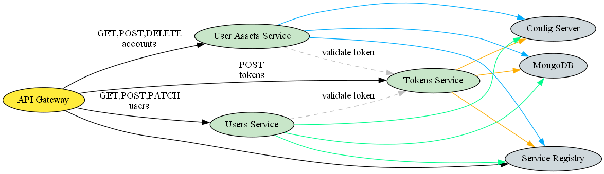
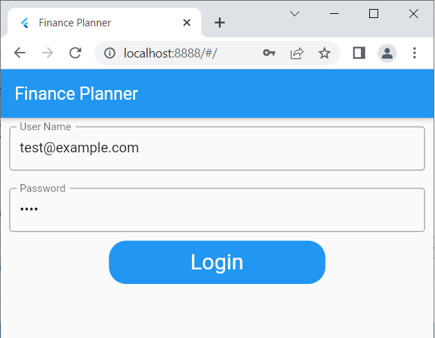
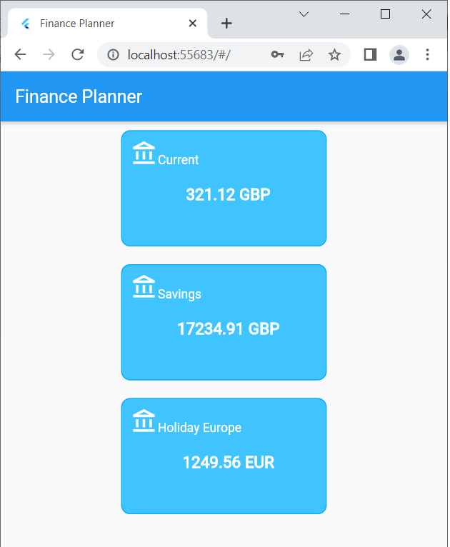

# Finance Planner

POC application to explore various frameworks: Spring Boot/Kotlin, Laravel 9, Flutter. I'm implementing the same API/the same clients in various frameworks to learn and to fight the forgetting curve.

## SpringBoot/Kotlin

Structured as a set of microservices and demonstrates a discovery service, API gateway, lightweight messaging between services (Rabbit MQ) and database persistance.

See code here: [SpringBootKotlin](FinancePlanner/SpringBootKotlin)

## Laravel 9

Classic Laravel monolith to explore new Laravel 9 features and as a reference design. Appreciated the ease of setting up the development environment thanks to Sail. This is for me also a great opportunity to familiarize with the latest Laravel out-of-the-box experience as my professional experience was on an app that was started long ago with Laravel 5 and still brought many tell tale signs of that.

See code here: [Laravel9](FinancePlanner/Laravel9)

## Flutter

A flutter client to consume the API. It offers a login screen and then renders a series of cards with user accounts data.

See code here: [Flutter](FinancePlanner/Flutter)

